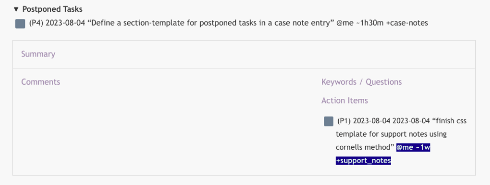

# caca README

Command extensions for implementing the Cornell method. CSS template included but still not automatically updates.

Set it in your CSS styles path as in [VS documentation](https://code.visualstudio.com/docs/languages/markdown#_using-your-own-css.)

## Features

- Command: `Insert Cornell notes schema`
  
- Command: `Insert Cornell reference`
  1. Copy the URL in your Clipboard
  2. Place cursor where the reference is desired.
  3. In Command Palette, `Insert Cornell reference`
  4. Insert a Title or leave empty, then ENTER.
  

## Requirements

- [Markdown Extended](https://marketplace.visualstudio.com/items?itemName=jebbs.markdown-extended)
   Use: `https://marketplace.visualstudio.com/items?itemName=jebbs.markdown-extended` 
   (Dependencies resulution still in construction.)
## Extension Settings

None

## Known Issues

Not yet

## Release Notes

This is just something I did to myself, while procrastinating from work.

## For more information

* [Visual Studio Code's Markdown Support](http://code.visualstudio.com/docs/languages/markdown)
* [Markdown Syntax Reference](https://help.github.com/articles/markdown-basics/)

**Enjoy!**
